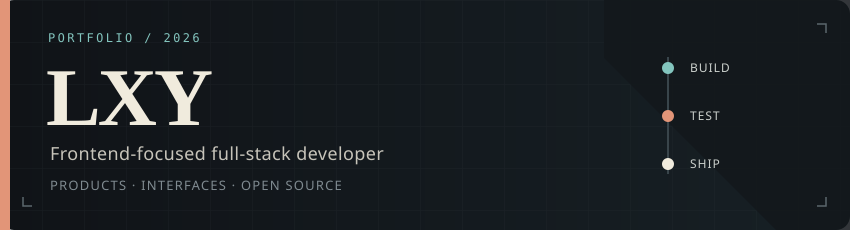
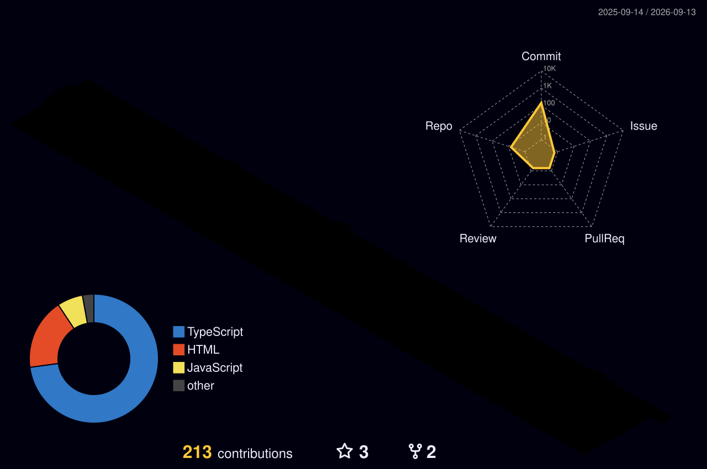

<div align="center">



<br/>

[](https://git.io/typing-svg)

</div>

<div align="center">
  
  
  
</div>

---

## `~/` About

Frontend / full-stack developer focused on building clean, fast, and practical web applications.

```ts
const lxy = {
  role: "Frontend / Full-stack Developer",
  stack: ["React", "TypeScript", "Next.js", "Node.js"],
  interests: ["Web Apps", "UI Engineering", "Full-stack Products"],
  currently: "Improving full-stack skills through real projects",
  contact: "zerolxy612@gmail.com",
};
```

---

## `~/` Tech Stack

<div align="center">

[](https://skillicons.dev)

</div>

---

## `~/` Contribution Snake

<div align="center">

<picture>
  <source media="(prefers-color-scheme: dark)" srcset="https://raw.githubusercontent.com/zerolxy612/zerolxy612/output/snake-neon.svg" />
  <source media="(prefers-color-scheme: light)" srcset="https://raw.githubusercontent.com/zerolxy612/zerolxy612/output/snake-dark.svg" />
  
</picture>

</div>

---

## `~/` Activity

<div align="center">



<br/>


</div>

---

## `~/` Contact

<div align="center">

[](mailto:zerolxy612@gmail.com)
[](https://github.com/zerolxy612)

<br/><br/>


</div>
